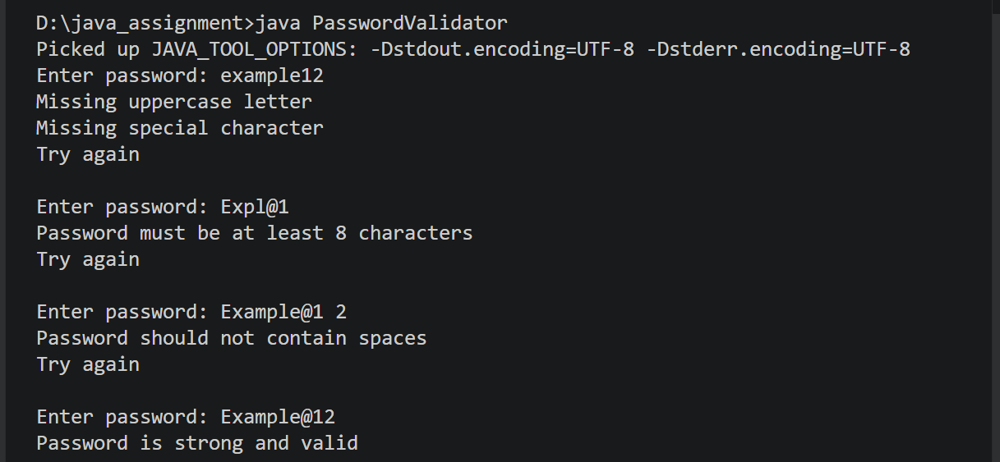

# Java Use Case – SafeLog Password Validator

## Overview
SafeLog Password Validator is a Core Java application designed to enforce strong password creation rules for an employee portal.  
The program validates user input against defined corporate security policies and provides clear feedback for each failed condition.  
The application continues prompting the user until a valid password is entered.

This use case demonstrates string manipulation, loop control, and modular validation logic using Core Java.

---

## Problem Statement
Build a Password Strength Checker that validates a string against corporate security policies and provides specific feedback on why a password failed.

---

## Password Policy Implemented

The password must satisfy the following conditions:

- Minimum 8 characters
- At least one uppercase letter
- At least one lowercase letter
- At least one digit (0-9)
- At least one special character
- No spaces allowed

The program validates each rule and prints specific messages if any condition fails.

---

## Features

- Password strength validation
- Character-by-character checking using loop
- Specific error messages for failed rules
- Retry mechanism until valid password
- Modular validation logic
- Simple CLI based interface

---

## Concepts Used

- Core Java
- String handling
- For loop
- While loop
- Character class methods
- Conditional statements
- Modular methods

---

## Validation Logic

The program checks:

- Password length
- Uppercase presence using Character.isUpperCase()
- Lowercase presence using Character.isLowerCase()
- Digit presence using Character.isDigit()
- Special character detection
- Space validation
- Retry until valid password

---

## Sample Execution
Enter password: abc
Too short
Missing uppercase letter
Missing digit
Missing special character

Enter password: Abcdefgh
Missing digit
Missing special character

Enter password: Abcdefg1
Missing special character

Enter password: Ab@1234c
Password is valid
---

## How to Compile
javac PasswordValidator.java

---

## How to Run
java PasswordValidator

---

## Project Structure

java_usecase
├── PasswordValidator.java
└── README.md
|__ Java_output.png

---

## Expected Output

---
## Outcome

This application enforces strong password policies and provides user-friendly feedback.  
It demonstrates the use of loops, string validation, and modular logic in Core Java.
